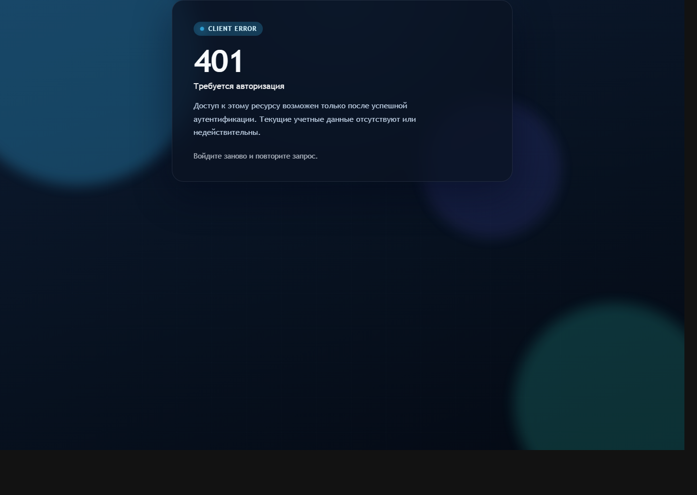
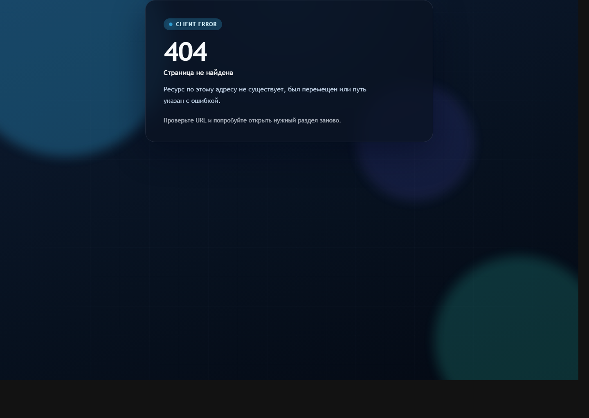
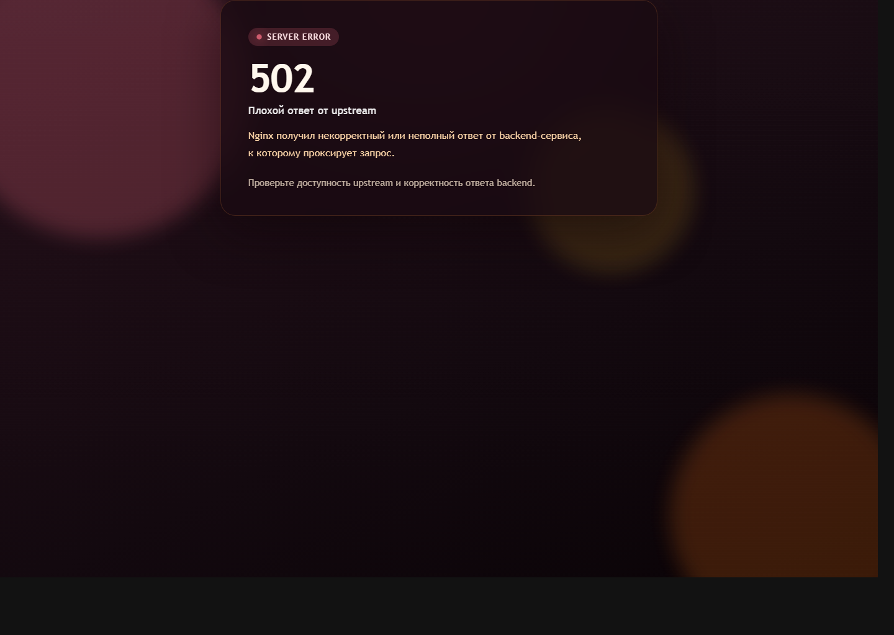
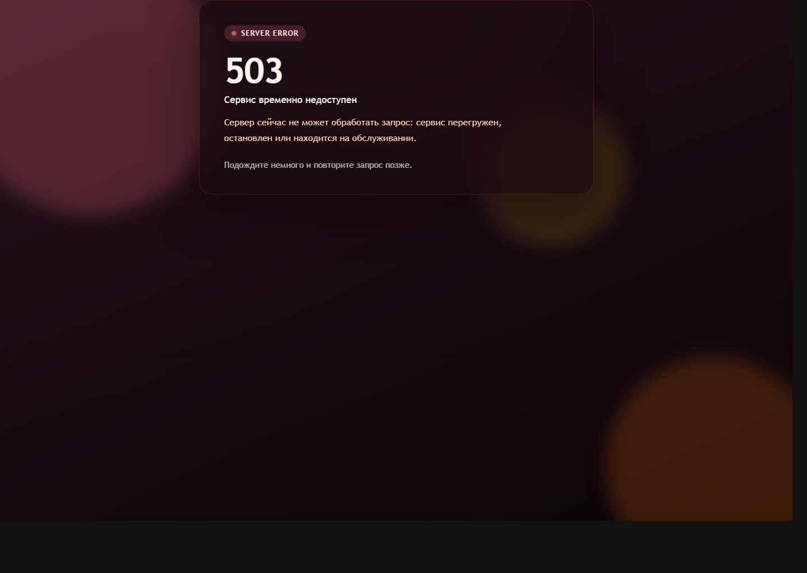
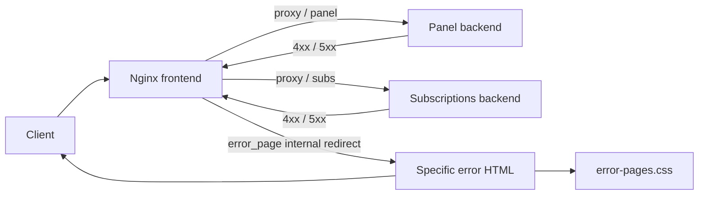

# 3xui-fallback

[](https://nginx.org/)
[](https://docs.docker.com/compose/)
[](#supported-errors)

Легковесный nginx-фронт для 3x-ui с кастомными fallback-страницами ошибок. Проект проксирует трафик на два backend-сервиса и подменяет стандартные nginx error pages на собственные HTML-шаблоны с общей анимацией и понятными сообщениями.

## Contents

- [Overview](#overview)
- [Preview](#preview)
- [Supported Errors](#supported-errors)
- [Request Flow](#request-flow)
- [Quick Start](#quick-start)
- [Project Structure](#project-structure)

## Overview

Что есть в проекте:

- `docker-compose.yml` для запуска nginx в `host` network
- `nginx.conf` как шаблон с `envsubst`
- отдельные HTML-страницы для `400`, `401`, `403`, `404`, `405`, `500`, `502`, `503`, `504`
- общий `html/error-pages.css` с легкой фоновой анимацией
- примеры реальных экранов в `docs/screenshots/`

Проект рассчитан на два upstream backend:

- панель
- подписки

## Preview

<p>
  
  
</p>
<p>
  
  
</p>

## Supported Errors

| Code | Meaning | Template |
| --- | --- | --- |
| 400 | Bad Request | `html/400.html` |
| 401 | Unauthorized | `html/401.html` |
| 403 | Forbidden | `html/403.html` |
| 404 | Not Found | `html/404.html` |
| 405 | Method Not Allowed | `html/405.html` |
| 500 | Internal Server Error | `html/500.html` |
| 502 | Bad Gateway | `html/502.html` |
| 503 | Service Unavailable | `html/503.html` |
| 504 | Gateway Timeout | `html/504.html` |

## Request Flow



Ключевая механика:

```nginx
proxy_intercept_errors on;
error_page 401 /401.html;
error_page 404 /404.html;
error_page 502 /502.html;
error_page 503 /503.html;
```

HTML-файлы лежат в `/usr/share/nginx/html`. Сами страницы ошибок отдаются только через внутренний редирект nginx, а общий CSS доступен отдельно, чтобы браузер мог загрузить стили.

## Quick Start

1. Создайте `.env` на основе `.env.example`.
2. Заполните домен, HTTPS-порты, backend-адреса и пути к сертификатам.
3. Задайте path prefixes для панели и подписок.
4. Если backend-сервисы слушают только `127.0.0.1` на хосте, оставьте `PANEL_BACKEND_HOST=127.0.0.1` и `SUBS_BACKEND_HOST=127.0.0.1`.
5. Запустите контейнер:

```bash
docker compose up -d
```

Что происходит при старте:

- переменные окружения подставляются в `nginx.conf`
- итоговая конфигурация проверяется через `nginx -t`
- nginx запускается в foreground-режиме

## Environment Variables

Основные настройки берутся из `.env`:

- `SITE_DOMAIN`
- `PANEL_HTTPS_PORT`
- `SUBS_HTTPS_PORT`
- `PANEL_PATH_PREFIX`
- `SUBS_PATH_PREFIX`
- `PANEL_BACKEND_HOST`
- `PANEL_BACKEND_PORT`
- `PANEL_BACKEND_SCHEME`
- `SUBS_BACKEND_HOST`
- `SUBS_BACKEND_PORT`
- `SUBS_BACKEND_SCHEME`
- `SSL_CERT_FULLCHAIN_PATH`
- `SSL_CERT_PRIVKEY_PATH`

Для путей используйте формат:

- с ведущим `/`
- без завершающего `/`

Пример:

```env
PANEL_PATH_PREFIX=/super_duper_proxy_panel
SUBS_PATH_PREFIX=/comrades
PANEL_BACKEND_HOST=127.0.0.1
SUBS_BACKEND_HOST=127.0.0.1
PANEL_BACKEND_SCHEME=http
SUBS_BACKEND_SCHEME=http
```

Если panel backend на `127.0.0.1:19000` сам поднимает TLS и отвечает только по `https`, укажите:

```env
PANEL_BACKEND_SCHEME=https
```

Иначе nginx будет ходить к backend по `http`, а backend начнет отвечать `307 Temporary Redirect` на тот же внешний URL панели.

Для страницы подписок location должен проксировать не только `/SUBS_PATH_PREFIX/<subid>`, но и вложенные пути вида `/SUBS_PATH_PREFIX/<subid>/...`, потому что `3x-ui` подгружает ассеты страницы относительно динамического `subid`. Поэтому в шаблоне nginx используется префиксный `location ^~ ${SUBS_PATH_PREFIX}/`.

Некорректные `subid`, на которые backend отвечает `400` или `404`, тоже подхватываются `error_page` и показывают кастомную страницу вместо сырого `Error!`.

## Project Structure

```text
.
├── .env.example
├── .gitignore
├── README.md
├── docker-compose.yml
├── nginx.conf
├── docs/
│   └── screenshots/
│       ├── 401.png
│       ├── 404.png
│       ├── 502.png
│       └── 503.png
└── html/
    ├── error-pages.css
    ├── 400.html
    ├── 401.html
    ├── 403.html
    ├── 404.html
    ├── 405.html
    ├── 500.html
    ├── 502.html
    ├── 503.html
    └── 504.html
```
